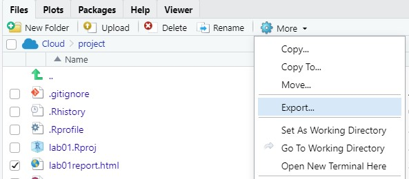

```{r setup, include=FALSE}
knitr::opts_chunk$set(echo = TRUE)
```

# Instructions

Welcome to Lab 2! Complete the following exercises designed to help get you up and running in R and RStudio. It is important that you keep your answers inside the ".answer" blocks. Do NOT delete the three colon blocks (:::) and keep your responses between them. Use the tutorial for help, and feel free

Depending on your instruction method (synchronous or asynchronous), complete the following exercises collaboratively.

1. **Synchronous remote:** You will be placed in a Zoom breakout room to work together in small groups.
1. **Asynchronous remote:** Use Piazza for asynchronous collaboration.

**Collaborators:** If applicable, replace this text with the names of anyone you collaborated with on this project.

# Lab Assignment

In Questions 1 - 5, we'll be using a data set we'll call `a2trees` that contains information about a subset of the top 9 types of trees planted around Ann Arbor in 2009. The city maintains an interactive map of all such trees at [this link](https://gisappsecure.ewashtenaw.org/Html5Viewer_2_11/index.html?viewer=A2Trees.A2Trees) -- you should check it out. They're updating the database this year, too!

## Question 1

:::{.question}
We'll start by reading in the data. The data are stored in a file called `a2trees_clean.csv`. We give the name of this file (*in quotes!*) to the `read.csv()` function. Complete this task in the chunk set up below by reading the .csv file and calling it `a2trees`.
:::

:::{.answer}
```{r question1, error = T}
# Use this code chunk to write the code necessary to answer the question. Do not start your code on this line, and do not start your code with # (this is a comment, R will ignore it).

```
:::

## Question 2

:::{.question}
Before we make graphs or numerical summaries, give an overview of the data set in 2-3 sentences. Use whatever tools you like to preview the contents of the data. The goal is for you to understand what's going on in the data set before working with it. Include any code in the chunk below. (*Disclaimer: There's not a right or wrong answer here -- just explore.*) You might want to revisit functions used in lab 1.
:::

:::{.answer}
```{r question2, error = T}
# Use this code chunk to write the code necessary to answer the question. Do not start your code on this line, and do not start your code with # (this is a comment, R will ignore it).

```

Replace this text with your 2-3 sentence overview of the data set.

:::

## Question 3

:::{.question}
Summarize the variable `ConditionTreeHealth`. If it is a numeric variable, be sure to discuss the mean, median, IQR, mix, and max. If it is a categorical variable, be sure to discuss the variable's levels (possible values) as well as the quantity of each level.
:::

:::{.answer}
```{r question3, error = T}
# Use this code chunk to write the code necessary to answer the question. Do not start your code on this line, and do not start your code with # (this is a comment, R will ignore it).

```

Replace this text with your discussion on the variable `ConditionTreeHealth`.
:::

## Question 4

:::{.question}
Make an appropriate graphical display for the variable `ConditionTreeHealth`. Be sure to include a proper title for your graphical display.
:::

:::{.answer}
```{r question4, error = T}
# Use this code chunk to write the code necessary to answer the question. Do not start your code on this line, and do not start your code with # (this is a comment, R will ignore it).

```
:::

## Question 5

:::{.question}
Make a two-way contingency table for tree health and common genus.
:::

:::{.answer}
```{r question5, error = T}
# Use this code chunk to write the code necessary to answer the question. Do not start your code on this line, and do not start your code with # (this is a comment, R will ignore it).

```
:::

In Try It Questions 6 - 7, we will be revisiting the `penguins` data set from earlier. We have already used this data set so it should still be in your environment pane on the top right corner. Verify this is the case.

## Question 6

:::{.question}
Summarize the variable `bill_length_mm`. If it is a numeric variable, be sure to discuss the mean, median, IQR, mix, and max. If it is a categorical variable, be sure to discuss the variable's levels (possible values) as well as the quantity of each level.
:::

:::{.answer}
```{r question6, error = T}
# Use this code chunk to write the code necessary to answer the question. Do not start your code on this line, and do not start your code with # (this is a comment, R will ignore it).

```

Replace this text with your discussion on the variable `bill_length_mm`.
:::

## Question 7

:::{.question}
Make an appropriate graphical display for the variable `bill_length_mm`. Be sure to include a proper title for your graphical display.
:::

:::{.answer}
```{r question7, error = T}
# Use this code chunk to write the code necessary to answer the question. Do not start your code on this line, and do not start your code with # (this is a comment, R will ignore it).

```
:::


<hr />
# Wrap-Up and Submission

At the top of the document, make sure you've changed the `author` field to your name (in quotes!). If you'd like, change the date as well.

When you've finished the lab, click the **Knit** button one last time.<br />


Give yourself a high five - you just wrote code! *Do not violate social distancing guidelines to give anyone else a high five :(*

### Submission instructions
<!-- This is a comment and will not show up in your document. Note that the
numbering here is all 1's. This will automatically be converted to 1, 2, etc.
when you knit the document; writing all 1's makes it so you don't have to
constantly update the numbering when you move things around in editing! -->

  #### If you're using RStudio Cloud
  1. In the Files pane, check the box next to `lab01report.html`: </br>
  
2. Click More > Export... </br>
  
3. Click Download and save the file on your computer in a folder you'll remember and be able to find later. You can just call the file `lab01-report.html` or whatever else you'd like (as  long as you remember what you called it). </br>
  

#### If you're using RStudio installed on your computer
1. Locate the `lab01report.html` file on your computer. The file will be saved in the location indicated at the top of the files pane. <br>
  

#### Submission to Canvas

1. Click the "Assignments" panel on the left side of the page. Scroll to find "Lab 2", and open the assignment. Click "Submit Assignment". <br />
  

2. Towards the bottom of the page, you'll be able to choose `lab01-report.html` from the folder you saved it in from RStudio Cloud or noted if you're using RStudio Desktop. **You will only be able to upload a .html file -- do not upload any other file type.** <br />
  
3. Click "Submit Assignment". You're done!
